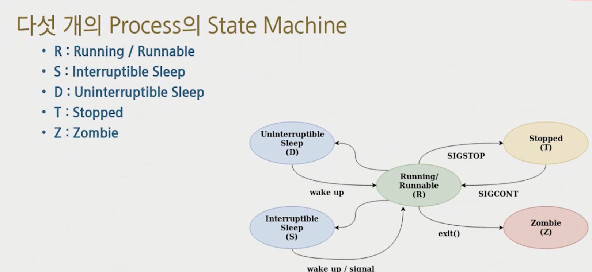

# Process

## 용어

- 프로그램 : 명령어의 집합
- 프로세서 : 프로그램을 실행하는 칩
- 프로세스 : 실행 된 프로그램


> 리눅스를 부팅하면 최초의 프로세스가 존재하고
>
> 모두 복제되어 생성된다.

- 각  프로세스는 ID 가 존재한다. PID
- 부모 프로세스와 자식 프로세스가 존재
  - ​	PID는 부모의 PID 를 알고있다.(PPID)


## Process 구성(암기)

- text - 코드
- data - 초기화된 전역변수
- bss - 초기값 없는 전역변수
- heap
- stack


## Virtual Address Space

각 프로세스는 연속적인 메모리 공간을 사용하고 있다고 착각하도록 한다.

메모리 파편화 관리가 편해짐


## 메모리 영역 확인

```bash
cat /proc/[PID]/maps
```


## 프로세스 스케쥴링

### 하나의 코어는 여러 개의 프로세스를 순환하면서 수행

- 특정 시간마다 번갈아가면서
- 대체로 라운드 로빈으로 동작하며 OS마다의 계산 공식에 의해 우선순위가 변경된다.


### 프로세스 간 메모리는 독립적 운영

- 각자 가상 메모리 주소 영역을 갖는다.  


### 만약 어떤 프로그램이 다른 프로그램에게 값을 전달하고 싶다면

- 프로세스끼리 값을 주고받는 것을 IPC(InterProcess Communication) 이라고 한다.
- IPC 방법
  - 프로세스끼리 공유하는 메모리 사용
  - 커널의 도움을 받아 대신 전달


### PCB (Process Control Block)

- 커널이 프로세스를 제어하기 위한 정보를 저장하는 블럭
- 프로세스 Descriptor 라고도 한다.
- 저장 정보
  - 프로세스 상태(State), PID
  - 프로세스에 대한 다양한 정보들을 보관


### 컨텍스트 스위칭

- 프로세스 끼리의 전환
- 프로세스의 PCB <-(복사)-> CPU 의 레지스터 

- 레지스터를 PCB에 백업한다. -> 이후 Program Counter Register가 정상적으로 복구되어 끊겼던 곳부터 이어서 수행한다.
- 프로세스 전환시 "컨텍스트 스위칭 비용이 발생"


### 컨텍스트 스위칭이 많으면?

- 동시에 수행되는 것처럼 보임 == 사용성이 좋아짐
- 대신 레지스터 복원 복구 횟수 증가
- 따라서 적절한 스케쥴링 정책 필요


## Process State Machine



## 좀비 State

- 하나의 프로세스는 자식 프로세스 생성 가능(fork Sysyem Call 사용)
- 자식이 죽으면, 부모가 자식의 Process Descriptor를 제거(PCB 제거)

### 자식 프로세스 종료과정

1. 부모 자식 중, 자식 프로세스가 Die
2. 자식 프로세스의 State = ZOMBIE 가 됨
   	- 아직 Process Descriptor가 남아있음
   	- 즉, 부모가 Descriptor를 제거하기 전까지 자식은 Zombie
3. 좀비 자식은, 부모에게 SIGCHILD Signal 을 보냄
4. 부모는 SIGCHILD를 받으면 wait() System Call 호출을 함
   - wait System Call에서 Process Descriptor 제거