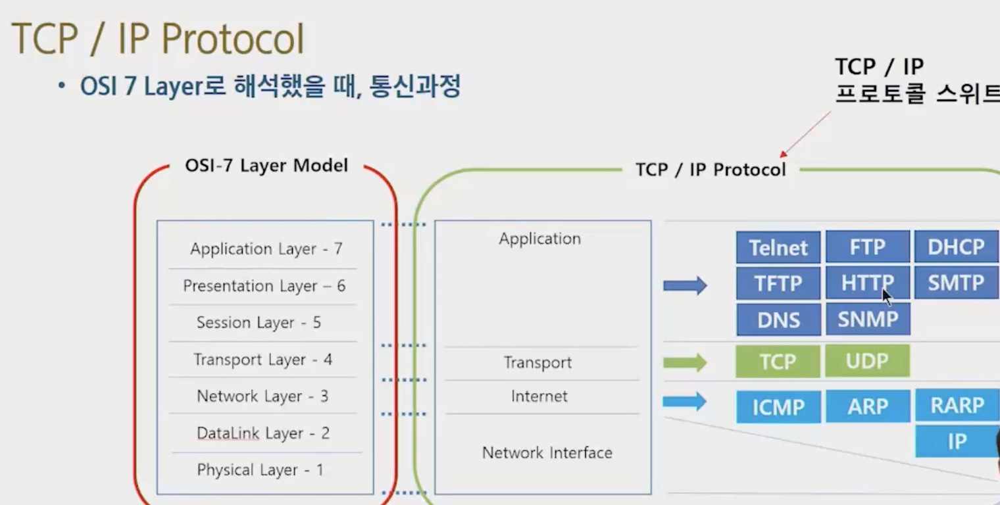

# TCP/IP

## IP 프로토콜

- 인터넷 프로토콜
- 노드에서 노드로 패킷을 전달하는 내용의 프로토콜
- 단순 전달

## TCP 프로토콜

- 전송 사고 등 처리
- 패킷이 섞여도 보낸 순서대로 받도록 함

## TCP/IP Protocol Suite

인터넷에서 사용하는 프로토콜 집합

> TCP, UDP
>
> ARP, IP, ICMP

### ICMP

IP 주소로 통신할 때 통신의 성공/실패를 나타내는 메세지 프로토콜

### TCP/IP

