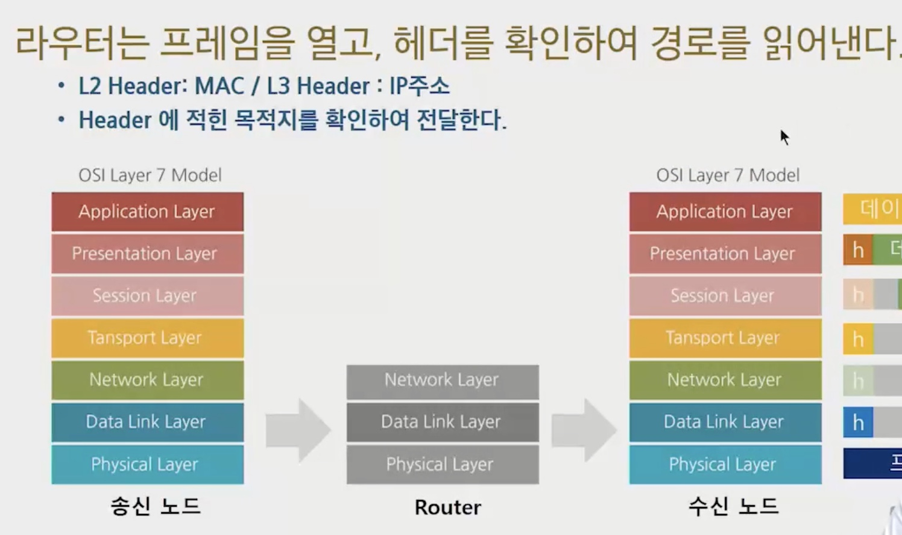
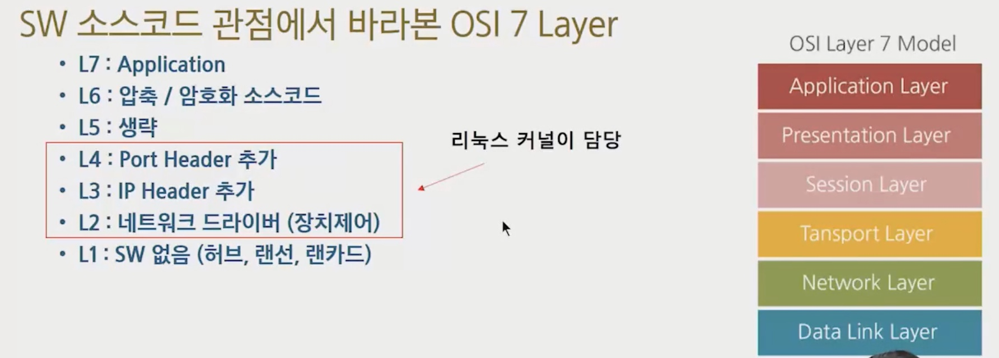

# Unicast, Broadcast

## 같은 네트워크에서 메세지 전달 방법

- 한 노드만 전달 - 유니캐스트
- 모든 노드에 전달 - 브로드캐스트
- 그룹핑, 후 해당 그룹에만 전달 - 멀티캐스트

## 허브에서 유니캐스트

1:1로 데이터를 전송하는 방식

- 데이터 출발지, 도착지를 적어둔다. (MAC 주소)
- LAN은 모든 네트워크에 신호를 뿌린다.
- 각 노드는 자신의 메세지가 아니라면 무시하고 버린다.

## 스위치에서 유니캐스트

### 스위치의 MAC Address Table

- 메세지를 보낸 노드의 MAC 주소가 어느 포트에 있는지 저장해둔다.
- 도착지 MAC 주소 확인 후, MAC 테이블을 확인하여, 어느 포트에 있는지 바로 알아낼 수 있다.
- 만약 MAC Table에 없다면 브로드캐스팅으로 전체에 신호를 뿌린다.

## ARP : Address Resolution Protocol

- 일반적으로 LAN 환경에서는 MAC 주소를 기반으로 통신한다.
- 상대방의 IP 주소만 알고 MAC 주소를 모른다면?
  - 이더넷 통신 불가
  - 따라서 ARP 프로토콜을 통해, IP 주소로 MAC 주소를 알아낸다.

### 단점

- ARP를 받으면 NIC(랜카드) 가 아닌 CPU가 처리하여 속도가 느려진다.
- 인터럽트 발생

### 한 네트워크에 PC가 많으면?

- PC 많을수록 브로드캐스팅이 자주 발생
- 브로드캐스팅 신호끼리 콜리젼 발생 가능성 높음
- 콜리젼 많아질수록 통신 지연 발생
- ARP Request가 많아짐

### 네트워크 분할 필요 -> 브로드캐스트 영역을 라우터를 이용하여 분할

### 라우터 역할

- Gateway : 서로 다른 네트워크 통신 목적
- 브로드캐스트 영역을 나누기 위함

# OSI 7 Layer

# IP

## 공인 IP

ICANN 조직, 전 세계 5개의 RIP로 나누어 관리

- 한국은 KRNIC
- KT/SK 브로드밴드 같은 LIR 존재

## 주소 구조

- Network Part + Host Part
  - 브로드캐스팅 영역에 있는 노드들은 Network Part 값이 모두 같은 값을 가져야 함
  - Host Part는 모두 다른 값을 가져야 함
- 192.168.9.3 / 24

## 공인 IP Class

네트워크 크기에 따라 Class 를 나눔(A~E)

- 유니캐스트로 사용할 수 있는 클래스는 A, B, C만 가능

## 사설 IP

- NIC (center)에서 하지 않고, 네트워크 관리자가 직접 할당
- IETF 표준

## 특수한 IP 주소

- Host ID의 모든 bit가 0인 주소 : 네트워크 주소

  - 192.168.0.0

- HostID의 모든 bit가 1인 주소 : 브로드캐스트 주소

  - 192.168.255.255

  

# 서브넷 마스크

네트워크 주소 구분 

왜? 한 네트워크에 너무 많은 PC가 붙어있으면 브로드캐스트가 너무 많아 통신이 불가

## 기본 서브넷 마스크

### B Class

- 앞 2바이트는 Network 주소, 뒤 2바이트는 Host 주소
- B클래스 기본 서브넷 마스크 : 255.255.0.0 

## 서브넷 마스크 왜 쓸까

- 클래스를 지켜 IP를 사용한다면, 어떤 클래스를 IP 를 사용하는지 알 수 있다.
- 그러나 요즘은 클래스 안쓰고 NAT + Classless Address 사용

## NAT? Network Address Translation

게이트웨이 밖으로 나갈때는 공인 IP주소, 내부 네트워크에서는 사설 IP 사용

-> 공인 및 사설 IP를 서로 변환해준다

NAT Table 에 사설 IP + 공인 IP 조합을 저장해 둔다.

- 라우터의 기능 중 하나!
- 라우터는 보내는 패킷을 라우팅 가능, 받는 패킷은 라우팅 불가
  - 받는 패킷의 목적지의 IP 주소가 사설 IP 이기 때문

## DHCP

한 네트워크에 같은 IP 주소가 없도록 자동 할당 기능

